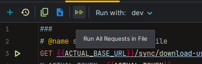

# API Requests

Requires the [IntelliJ HTTP Client IDE plugin](https://www.jetbrains.com/help/idea/http-client-in-product-code-editor.html).

# Setup (Actual)
Create a file at `api/http-client.private.env.json` looking like below:

```json
{
  "dev": {
    "ACTUAL_BASE_URL": "https://url.of.my.server.com",
    "ACTUAL_TOKEN": "cd0892fb-063e-4cce-ab4a-a3c85fc3280c",
    "ACTUAL_PASSWORD": "P@ssw0rd",
    "ACTUAL_MAIN_FILE_ID": "6b76ed8e-88f7-4d09-bff3-1a20e62218dc",
    "ACTUAL_TEST_FILE_ID": "df27643d-5fcf-4a3a-a535-6feaaa1bf592"
  }
}
```

and enter your server's info. You can get `ACTUAL_TOKEN` from the response to the `account/login` request, and the two `*_FILE_ID` values from `sync/list-user-files`.

# Running

First select the run config (on a per-file basis), then either click the run button in the left-hand gutter or run all from the file's toolbar.


