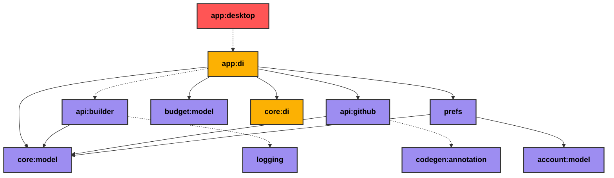

# app:desktop
> :warning: This readme is autogenerated with `gradle generateReadme`. Do not edit manually! :warning:

| Module Type | Colour |
|:--:|:--:|
| App |  |
| DI |  |
| Multiplatform |  |

