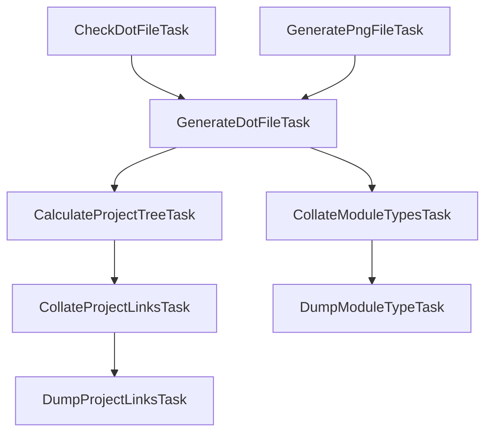

# Diagram Task Dependencies

These tasks don't have explicit dependencies between them because of https://github.com/jonapoul/actual-android/issues/297 - where there was an occasional IDE sync error coming from somewhere in the diagram generation task links. So I've just split it out into a script instead.

Regenerate by running `gradle scripts/generateModulesPng.sh`.
