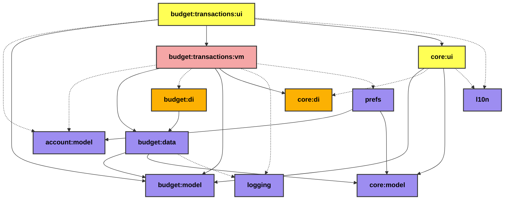

# budget:transactions:ui

<table>
<tr><th colspan='2'>Legend</th></tr>
<tr><td style='text-align:center;'>ViewModel</td><td style='text-align:center; background-color:#F5A6A6; color:black'>module-name</td></tr>
<tr><td style='text-align:center;'>DI</td><td style='text-align:center; background-color:#FCB103; color:black'>module-name</td></tr>
<tr><td style='text-align:center;'>Compose</td><td style='text-align:center; background-color:#FFFF55; color:black'>module-name</td></tr>
<tr><td style='text-align:center;'>Multiplatform</td><td style='text-align:center; background-color:#9D8DF1; color:black'>module-name</td></tr>
</table>

