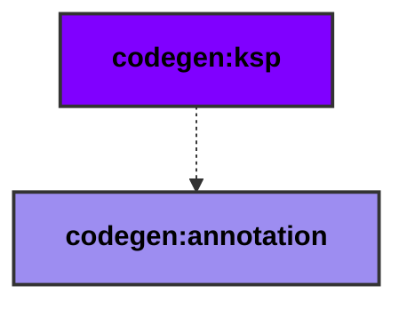

# codegen:ksp
> :warning: This readme is autogenerated with `gradle generateReadme`. Do not edit manually! :warning:

| Module Type | Colour |
|:--:|:--:|
| Multiplatform |  |
| JVM |  |

```mermaid
graph TD
codegenannotation["codegen:annotation"]
codegenksp["codegen:ksp"]
style codegenannotation fill:#9D8DF1,stroke:#333,stroke-width:2px,color:black,font-weight:bold
style codegenksp fill:#8000FF,stroke:#333,stroke-width:2px,color:black,font-weight:bold
codegenksp -.-> codegenannotation
```
