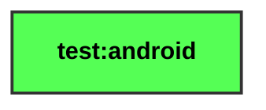

# test:android

<table>
<tr><th colspan='2'>Legend</th></tr>
<tr><td style='text-align:center;'>Android</td><td style='text-align:center; background-color:#55FF55; color:black'>module-name</td></tr>
</table>

