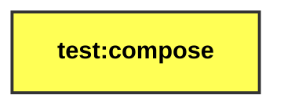

# test:compose
> This readme is autogenerated with `gradle generateReadme`. Do not edit manually!
<table>
<tr><th colspan='2'>Legend</th></tr>
<tr><td style='text-align:center;'>Compose</td><td style='text-align:center; background-color:#FFFF55; color:black'>module-name</td></tr>
</table>

