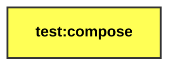

# test:compose
> :warning: This readme is autogenerated with `gradle generateReadme`. Do not edit manually! :warning:

| Module Type | Colour |
|:--:|:--:|
| Compose |  |

```mermaid
graph TD
testcompose["test:compose"]
style testcompose fill:#FFFF55,stroke:#333,stroke-width:2px,color:black,font-weight:bold
```
