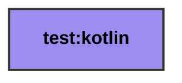

# test:kotlin

<table>
<tr><th colspan='2'>Legend</th></tr>
<tr><td style='text-align:center;'>Multiplatform</td><td style='text-align:center; background-color:#9D8DF1; color:black'>module-name</td></tr>
</table>

